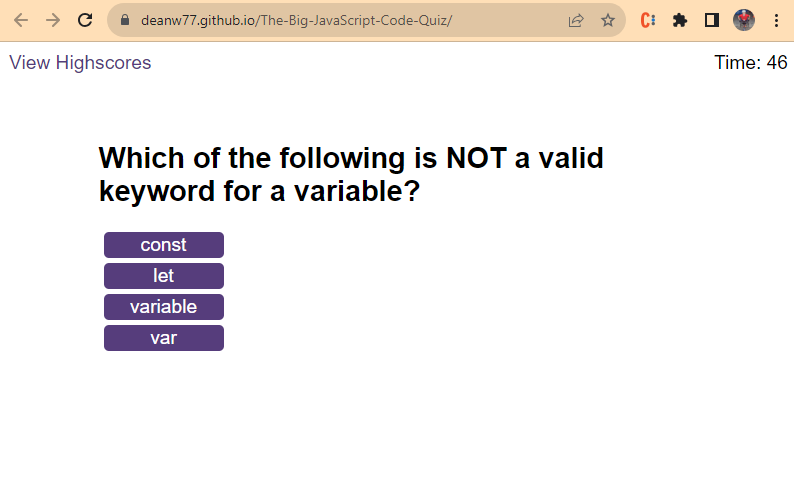
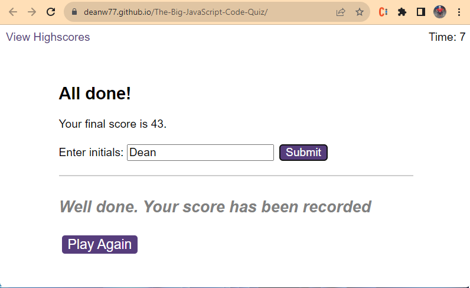
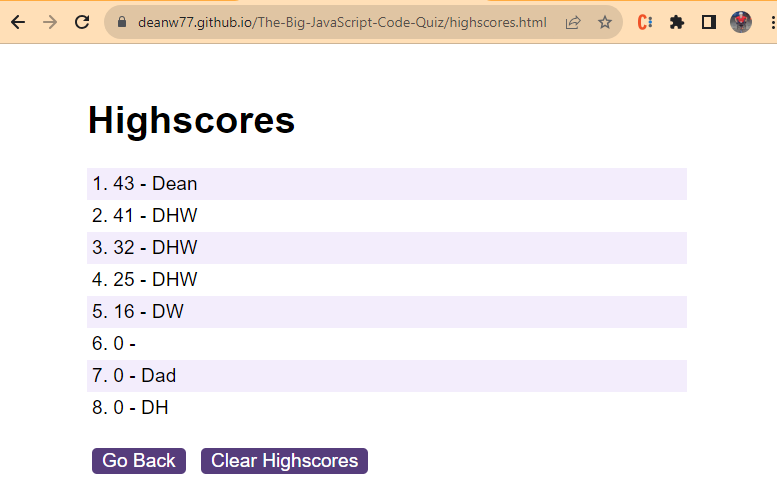

# The Big JavaScript Code Quiz

Build a timed JavaScript quiz that scores the high scores along with the user initials

## User Requirements

1) A working quiz that moves from question to question and records the users score.
2) Quiz will be timed and the remaining time will be the final score.
3) High scores need to be stored in local storage and displayed to High Scores page.
4) Implement sounds to play for correct and incorrect answers.
5) Ensure High Scores are displayed in decending order. 
6) Show an option to play again at the end of the game.

## Problems Solved

1) By far the biggest problem I had - combining the two arrays (scores and initials) into one array and then sorting them in decending order. 😡 Frustrating! But got it figured out, lesson learnt = Persevere! 
2) Local Storage, both storing and retrieving data presented difficulties. More practice with that definitely needed. 
3) Play Again button along with a message confirming score has been recorded
4) A bit of trial and error getting ratio of questions available to time available. I didn't want tose less comfortable with JavaScript to be unable to get the end of questions. 
5) Honestly - one problem was definitely fighting the urge to say "that'll do", giving up on a feature. Take a step back, write more psuedocode, then come back and fix the problem. 

## Hosted Site

Try the quiz here:  
https://deanw77.github.io/The-Big-JavaScript-Code-Quiz/

### Project Overview

In a Word - Brutal !  

That was by far the most challenging assignment so far. It both tested my understanding of everything learnt and pushed me to turn to google to learn some more. After this, I am certainly getting more comfortable with handling date and moving between arrays and objects. 
Huge learning curve but also huge sense of achievement when i finally got the application working as I wanted. 

### Final Result

### Going Forward

Due to how challenging I found this project it's certainly one that I'll want on my portfolio. Prior to that though there are some changes and improvements I wish to implement: 

* Improve the scrollQuestions() function to be more efficient.
    * I need to change the code to avoid the four seperate event listeners to reduce code length.
* Add options for HTML and CSS quizzes too.
* Change the scoring back to points per correct answer.
    * It was initially done like this and changed due to assignment requirements, but I prefer the points per question with additional points for remaining time.
* Improve the user interface.